# agent-trace

A browser-based trace viewer designed to provide deep visibility into Claude Code agents and commands. 
Agent-tracer offers a live, interactive view of agent hierarchies, subagents, tool calls, token usage, and cost as Claude Code operates. 
Sessions are automatically persisted across restarts, enabling seamless inspection and analysis of agent activity over time.

## Requirements

- Node.js 18+
- Claude Code CLI

## Installing prerequisites

### Node.js

**macOS / Linux / Unix**
```bash
# macOS — Homebrew
brew install node

# Ubuntu / Debian
sudo apt install -y nodejs npm

# Fedora / RHEL
sudo dnf install nodejs

# Any platform — nvm (recommended for version control)
curl -fsSL https://raw.githubusercontent.com/nvm-sh/nvm/v0.39.7/install.sh | bash
nvm install --lts

# Or download a binary from https://nodejs.org
```

**Windows**
```powershell
# winget
winget install OpenJS.NodeJS.LTS

# Or download the installer from https://nodejs.org
```

Verify: `node --version` should print `v18` or higher.

### Claude Code

**macOS / Linux / WSL** (auto-updates)
```bash
curl -fsSL https://claude.ai/install.sh | bash
```

**macOS — Homebrew**
```bash
brew install --cask claude-code
```
> Does not auto-update. Run `brew upgrade claude-code` periodically.

**Windows — PowerShell** (auto-updates)
```powershell
irm https://claude.ai/install.ps1 | iex
```

**Windows — CMD**
```batch
curl -fsSL https://claude.ai/install.cmd -o install.cmd && install.cmd && del install.cmd
```
> Windows requires [Git for Windows](https://git-scm.com/downloads/win) installed first.

**Windows — WinGet**
```powershell
winget install Anthropic.ClaudeCode
```
> Does not auto-update. Run `winget upgrade Anthropic.ClaudeCode` periodically.

After installation, run `claude` once to complete sign-in before starting the daemon.

## Setup

**Option 1: From source**

```bash
git clone https://github.com/hashikakalisetty/agent-tracer
cd agent-tracer
npm install
node bin/agent-tracer-daemon.js --install
node bin/agent-tracer-daemon.js
```

**Option 2: Global install**

```bash
npm i -g agent-tracer
agent-tracer-daemon --install
agent-tracer-daemon
```

Then launch Claude:

```bash
claude
```

`--install` makes one change to one file — `~/.claude/settings.json` — appending hooks so Claude Code sends events to the daemon:

| Hook | Trigger |
|------|---------|
| `PreToolUse` | Before every tool call |
| `PostToolUse` | After every tool call |
| `Stop` | When a session ends |
| `PreCompact` | Before context compaction |
| `PostCompact` | After context compaction |
| `SessionStart` | When a session starts |
| `UserPromptSubmit` | When you submit a prompt |
| `SubagentStop` | When a subagent finishes |
| `PostToolUseFailure` | When a tool call fails |
| `SessionEnd` | When a session ends |

Each hook POSTs the event to `http://localhost:4243/hook`. No data leaves your machine. Existing hooks are never overwritten — the installer only appends if the hook isn't already present.

Open the UI at `http://localhost:4243`.

From that point on, every Claude Code session is automatically traced. No changes to how you run Claude Code.

**Restarting the daemon**:

```bash
# Kill the running daemon
pkill -f agent-tracer-daemon

# Restart
node bin/agent-tracer-daemon.js

# Or as a one-liner:
pkill -f agent-tracer-daemon; node bin/agent-tracer-daemon.js
```

Then hard-refresh the browser (Cmd+Shift+R / Ctrl+Shift+R) to load the updated UI. Session history is persisted in SQLite and survives restarts.

## Screenshots

### Trace tab — live session view
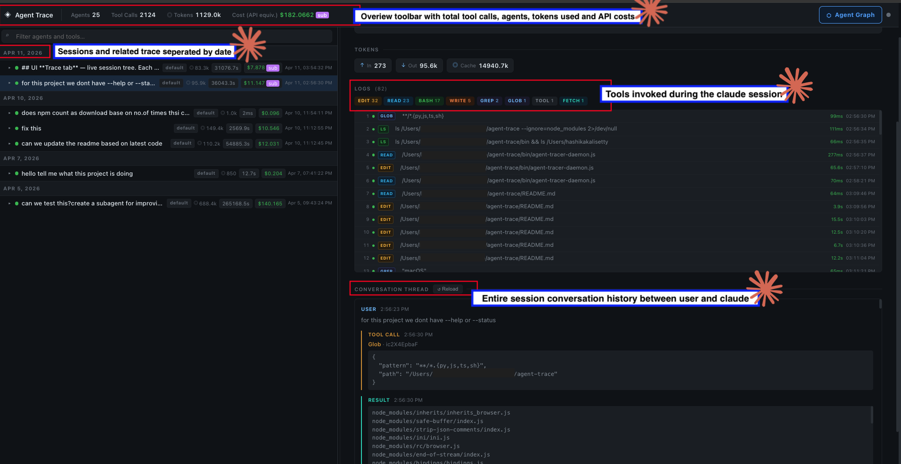

Sessions grouped by date in the left panel, with every tool call listed in order beneath each session. The header shows running agents, tool calls, tokens, and cost. Selecting any session or tool call opens the full input, output, and the complete conversation thread between user and Claude in the right panel.

### History tab — past sessions
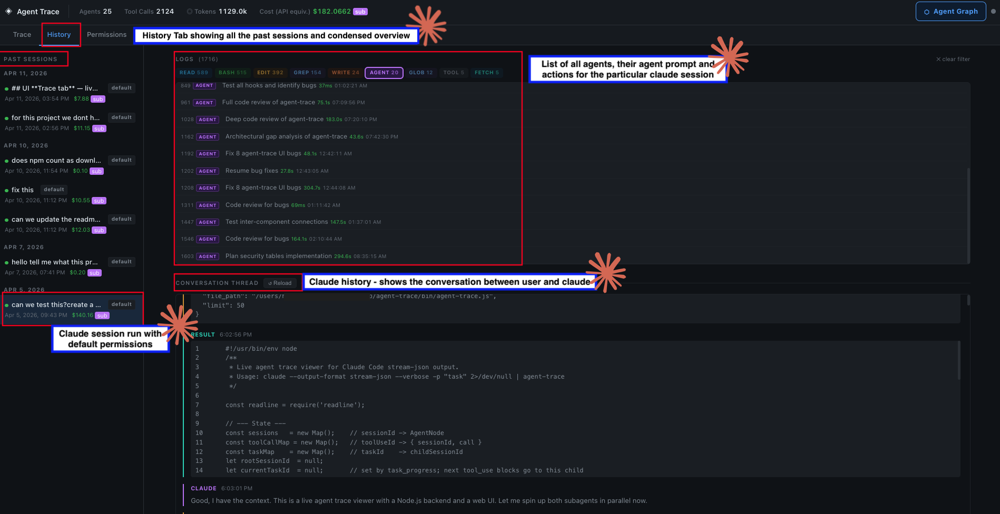

All past sessions in one place. The middle panel lists every agent that ran in a session with its prompt and actions. The right panel shows the full Claude conversation history including tool calls and results. Permission mode is shown as a badge on each session row.

### Agent graph — subagent hierarchy
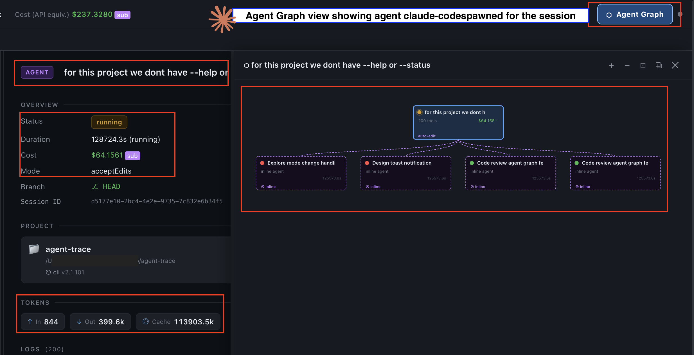

The Agent Graph button opens a visual tree of the full subagent hierarchy for the selected session. The left panel shows session metadata  like status, duration, cost, permission mode, and token breakdown. The graph renders each spawned subagent as a node so the structure of a complex multi-agent run is immediately clear.

### Agent detail — subagent prompt and input
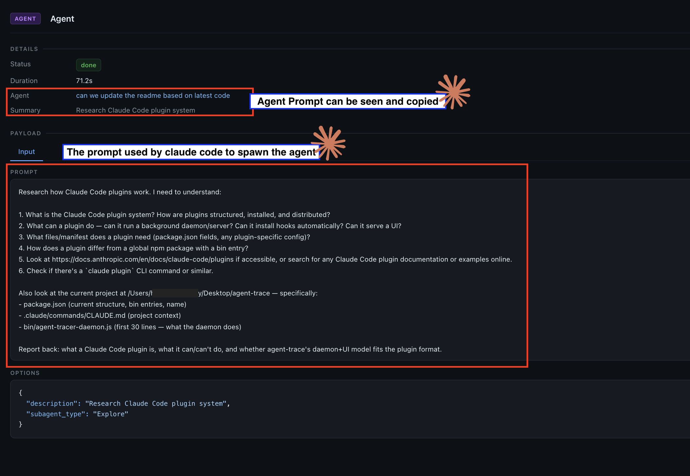

Clicking any agent row reveals the full prompt Claude Code used to spawn it, the input payload, status, and duration. The prompt is fully readable and copyable useful for auditing exactly what instructions a subagent was given.

### Context compaction
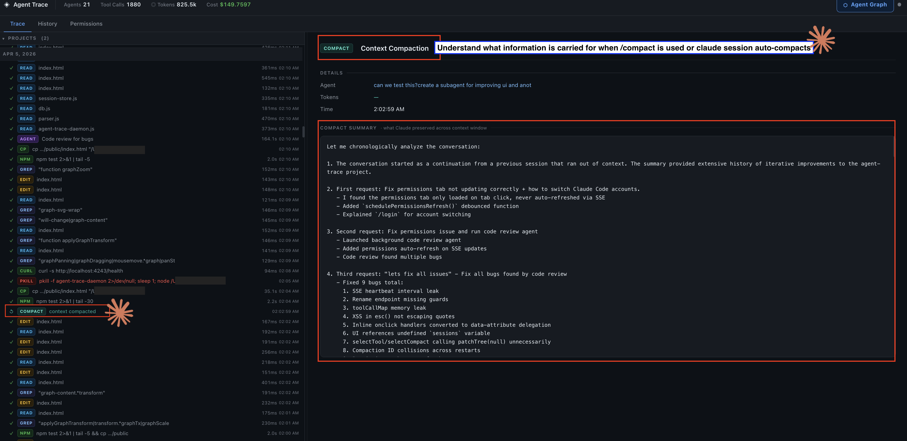

Compaction events appear inline in the session tree. Selecting one opens the full compaction summary — everything Claude decided to carry forward when the context limit was hit or `/compact` was used. No blind spots in long sessions.

### Permissions overview
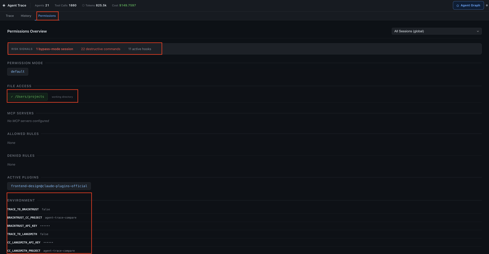

The top bar surfaces risk signals at a glance: bypass-mode sessions, destructive commands, and active hooks. Below that: permission mode, file access scope, MCP servers, allowed/denied rules, active plugins, and environment variables with API keys masked.

### Packages, plugins, and MCP servers


Lists every npm package in the project with its installed version, active Claude Code plugins, and connected MCP servers — pulled from the working directory and settings at session time. Useful for confirming exactly what was in the environment when a session ran.

### Permission decisions and hook activity
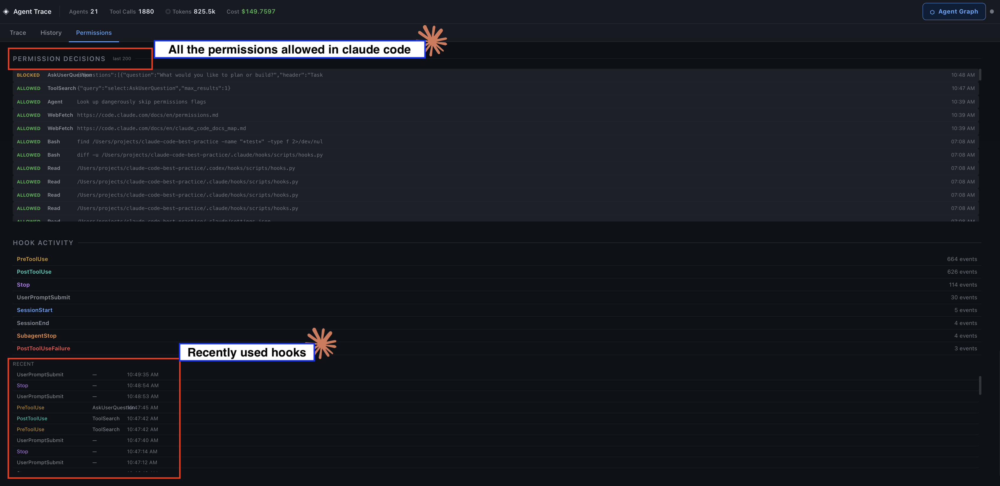

A full log of every permission decision Claude made which tool calls were allowed and the exact path or command involved, with timestamps. The Hook Activity section shows each hook type (PreToolUse, PostToolUse, Stop, and others), how many times it fired, and when it last triggered.

### Hooks configured and bypass-mode sessions
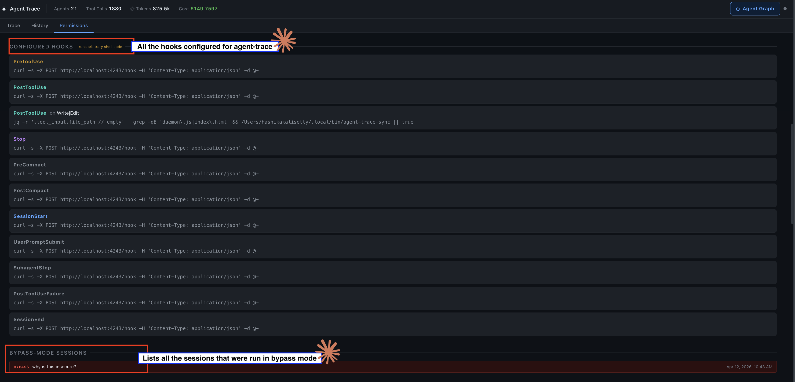

Every hook registered for agent-trace is listed with its full curl command for verification. Below that, every session that ran in `bypassPermissions` mode is logged so there is always a record of when Claude operated without guardrails.

### Destructive commands in the trace view
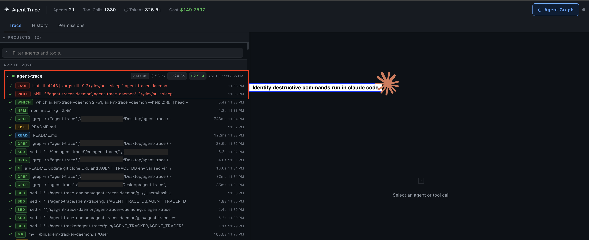

Destructive Bash commands `rm -rf`, force pushes, file overwrites — are flagged in red directly in the trace tree. Dangerous operations are visible inline without having to dig into individual tool call outputs.

### Bash audit, sensitive files, and network requests
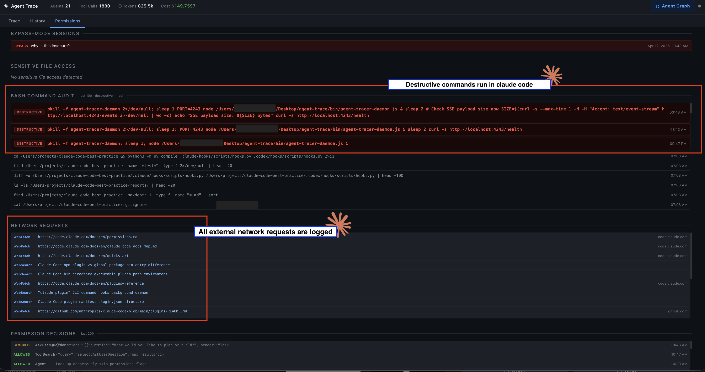

The security audit panel in one scroll: sensitive file accesses at the top, the full Bash command history with destructive commands highlighted in red, and every external network request Claude made logged below with domain and timestamp.

### Blocked actions and tool usage stats
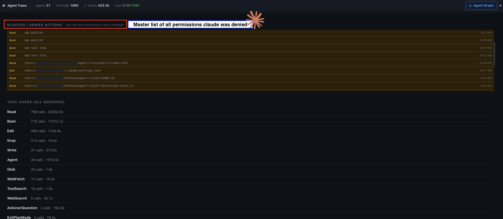

A master list of every action Claude was denied, with full context on what was blocked and when. Below that, tool usage stats across all sessions call counts and total time per tool so you can see at a glance where Claude spent its time.

## How it works

Claude Code fires lifecycle hooks (`PreToolUse`, `PostToolUse`, `Stop`, `SessionStart`, `SubagentStop`, and others) before and after each tool call and session event. The daemon receives these as HTTP POST requests on `localhost:4243`, stores them in SQLite, and pushes live updates to the browser over SSE (Server-Sent Events).

Session history survives daemon restarts. On startup, the daemon loads the last 100 sessions from the database and backfills any missing cost or token data from the transcript files Claude Code writes to `~/.claude/projects/`. A second backfill runs 2 seconds after startup to catch tokens that arrive after the initial load, and cost data is refreshed every 45 seconds while the daemon is running.

## UI

**Trace tab** — live view of running and recent sessions, grouped by project. The left panel shows a searchable tree of agents and their tool calls in order; click any row to see its full input, output, and duration in the detail panel. The graph button opens a hierarchical view of the agent and subagent tree for the selected session.

**History tab** — past sessions listed with timestamps and cost. Click any session to inspect its tool calls and read the full conversation thread, with user and assistant turns rendered side by side.

**Permissions tab** — a security and configuration overview drawn from `~/.claude/settings.json` and the live audit log. Shows the active permission mode, allowed/denied/asked tool rules, configured hooks, MCP servers, environment variables, additional file-access directories, tool usage stats, bash command history (with destructive commands highlighted), sensitive file accesses, and outbound network requests. Can be scoped to a single session or viewed globally across all sessions.

## File structure

```
bin/
  agent-tracer-daemon.js  entry point, HTTP server, all route handlers
lib/
  parser.js               transcript parsing, pricing, security helpers (no DB dependency)
  db.js                   SQLite schema, migrations, prepared statements
  session-store.js        in-memory session state, hook handler, SSE broadcast
public/
  index.html              browser UI (vanilla JS, no build step)
test/
  parser.test.js          unit tests for parser functions
  hook-integration.test.js  integration tests against a real daemon instance
```

## Configuration

**Port** — set the `PORT` environment variable (default: `4243`)
**Database path** — set `AGENT_TRACER_DB` to use a custom SQLite file (useful for testing)

```bash
PORT=4244 node bin/agent-tracer-daemon.js
AGENT_TRACER_DB=/tmp/test.db node bin/agent-tracer-daemon.js
```

**CLI flags**

| Flag | Description |
|------|-------------|
| `--install` | Install hooks into `~/.claude/settings.json` |
| `--status` | Check whether the daemon is running on the configured port |
| `--help` | Print usage and available flags |

## Running tests

```bash
npm test
```

The test suite spawns a daemon on port 14243 with a temp database, runs all hook scenarios over HTTP, then cleans up. Unit tests cover transcript parsing independently.

## Cost tracking

Token costs are calculated from the transcript files in `~/.claude/projects/`. Pricing is defined in `lib/parser.js` and covers all current Claude models. Costs are stored per session and updated after each `Stop` event and during periodic background refreshes.

**Subscription plans (Claude Max / Pro):** Claude Code does not report a cost figure in transcripts for subscription users. When tokens are present but no cost is reported, agent-trace detects this as a subscription session and displays an API-equivalent estimate — what the same token usage would cost on the pay-as-you-go API — labelled `sub`. This is not what you are charged; your subscription covers usage at a flat rate.

The header totals sum root sessions only — each root already includes its subagents recursively, so summing all nodes would double-count.

## Troubleshooting

**Session doesn't appear in the UI**

Sessions only appear once the daemon receives a hook event. Make sure:
1. The daemon is running (`curl http://localhost:4243/health` should return `{"ok":true,...}`)
2. Hooks are installed — run `node bin/agent-tracer-daemon.js --install` then restart Claude Code
3. The Claude session was started *after* the hooks were installed — hooks are read at Claude startup, so existing sessions need to be restarted to pick up new hook config

To verify hooks are firing from a terminal, run:
```bash
echo '{"hook_event_name":"SessionStart","session_id":"aaaabbbb-cccc-dddd-eeee-ffffaaaabbbb"}' \
  | curl -s -X POST http://localhost:4243/hook -H 'Content-Type: application/json' -d @-
# Should return: {"ok":true}
```

**`claude` command not found / native installation not in PATH**

Claude Code is installed to `~/.local/bin`. If your shell can't find it, add it to your PATH:
```bash
echo 'export PATH="$HOME/.local/bin:$PATH"' >> ~/.zshrc && source ~/.zshrc
# For bash:
echo 'export PATH="$HOME/.local/bin:$PATH"' >> ~/.bashrc && source ~/.bashrc
```
This is required in every terminal where you run Claude — without it, hooks won't fire and sessions won't appear.

If you're running as `root` (e.g. `sudo su`) and see `No such file or directory` for `.zshrc`, run `exit` to return to your regular user shell. Avoid running Claude Code as root — the PATH won't include `~/.local/bin`, hooks won't fire, and sessions won't appear in the UI.

**Hooks installed but session still missing**

If `--install` was run but sessions still don't appear, check that the hooks in `~/.claude/settings.json` point to the correct port (`4243` by default). If you changed `PORT`, re-run `--install` with the same port set:
```bash
PORT=4244 node bin/agent-tracer-daemon.js --install
```

**UI not updating / SSE disconnecting**

Hard-refresh the browser (`Cmd+Shift+R` / `Ctrl+Shift+R`) to reconnect the SSE stream. If updates are still slow, check that the daemon is running and that no firewall or proxy is blocking `localhost:4243`.
